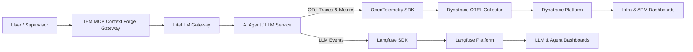

# Hybrid AI Observability Demo

> **Enterprise-Grade Observability for LLMs & AI Agents**

This repository demonstrates a **hybrid observability architecture** combining:
- **Dynatrace** - Enterprise APM, infrastructure, and distributed tracing
- **Langfuse** - AI/LLM-native observability (prompts, tokens, agent steps)
- **IBM MCP Context Forge** - Centralized AI gateway and MCP registry
- **LiteLLM** - OpenAI-compatible LLM gateway for local/remote models

## 🏗️ Architecture Overview



## 📁 Project Structure

```
ai-observability-demo/
├── docker-compose.yml          # Main orchestration file
├── .env.example                # Environment template
├── agent/                      # AI Agent with dual observability
│   ├── Dockerfile
│   ├── app.py
│   └── requirements.txt
├── mcp-gateway/                # IBM MCP Context Forge mock
│   ├── Dockerfile
│   ├── app.py
│   ├── mcp_registry.py         # MCP Server registry
│   └── requirements.txt
├── litellm/                    # LiteLLM configuration
│   └── config.yaml
├── otel/                       # OpenTelemetry configuration
│   └── otel-config.yaml
├── dashboards/                 # Dashboard configurations
│   ├── dynatrace-exec.json
│   └── langfuse-setup.md
└── docs/
    └── whitepaper.md
```

## 🚀 Quick Start

### Prerequisites

- Docker Desktop (with Docker Compose v2)
- Git Bash (Windows) or any Unix shell
- Dynatrace SaaS/Managed environment (trial works)
- Dynatrace API Token with:
  - `Ingest metrics`
  - `Ingest traces`
  - `Ingest logs`

### 1. Clone and Configure

```bash
git clone <your-repo>
cd ai-observability-demo

# Copy environment template
cp .env.example .env

# Edit .env with your Dynatrace credentials
# DYNATRACE_ENDPOINT=https://<YOUR_ENV>.live.dynatrace.com
# DYNATRACE_API_TOKEN=<YOUR_TOKEN>
```

### 2. Start All Services

```bash
# Start all at once
docker compose up -d

# Or start individually in order (see scripts/ folder)
./scripts/start-all.sh        # Linux/Git Bash
.\scripts\start-all.ps1       # PowerShell
```

### 3. Access Points (Port Range: 9001-9014)

| ID | Port | Component | URL | Description |
|----|------|-----------|-----|-------------|
| 01 | 9001 | PostgreSQL | localhost:9001 | Langfuse database (internal) |
| 02 | 9002 | ClickHouse | localhost:9002 | Analytics database (internal) |
| 04 | 9004 | Redis | localhost:9004 | Cache & queue (internal) |
| 05 | 9005 | MinIO | http://localhost:9005 | S3 storage API |
| 06 | 9006 | MinIO Console | localhost:9006 | Storage dashboard (internal) |
| 08 | 9008 | **Langfuse UI** | http://localhost:9008 | AI/LLM Observability Dashboard |
| 09 | 9009 | OTEL gRPC | localhost:9009 | OpenTelemetry gRPC endpoint |
| 10 | 9010 | OTEL HTTP | localhost:9010 | OpenTelemetry HTTP endpoint |
| 12 | 9012 | **LiteLLM** | http://localhost:9012 | OpenAI-compatible LLM Gateway |
| 13 | 9013 | **MCP Gateway** | http://localhost:9013 | IBM MCP Context Forge API |
| 14 | 9014 | **AI Agent** | http://localhost:9014 | Demo AI Agent |

> 📖 See **PORTS.md** for complete port reference and network diagram

### 4. Test the Pipeline

```bash
# Send a prompt through the MCP Gateway
curl -X POST "http://localhost:9013/mcp/invoke" \
  -H "Content-Type: application/json" \
  -d '{"prompt": "Explain hybrid observability for AI systems"}'
```

## 🔍 Observability Flow

### What Gets Observed

| Layer | Tool | What's Captured |
|-------|------|-----------------|
| Infrastructure | Dynatrace | CPU, memory, containers, network |
| Application | Dynatrace | API latency, error rates, traces |
| AI/LLM | Langfuse | Prompts, responses, tokens, agent steps |
| Correlation | Both | request_id links traces across systems |

### Correlation Keys

| Dimension | Used By | Purpose |
|-----------|---------|---------|
| `request_id` | Dynatrace + Langfuse | End-to-end tracing |
| `session_id` | Langfuse | Agent session analysis |
| `model_version` | Langfuse | Regression detection |
| `service.name` | Dynatrace | Dependency mapping |

## 🛠️ MCP Registry

The MCP Gateway includes a registry for adding MCP servers that can be used by AI agents.

### Register an MCP Server

```bash
curl -X POST "http://localhost:9013/mcp/registry/add" \
  -H "Content-Type: application/json" \
  -d '{
    "name": "weather-mcp",
    "url": "http://weather-mcp:8000",
    "capabilities": ["get_weather", "get_forecast"]
  }'
```

### List Registered Servers

```bash
curl "http://localhost:9013/mcp/registry/list"
```

### Use MCP Server in Agent

```bash
curl -X POST "http://localhost:9013/mcp/invoke" \
  -H "Content-Type: application/json" \
  -d '{
    "prompt": "What is the weather in New York?",
    "mcp_servers": ["weather-mcp"]
  }'
```

## 📊 Dashboard Views

### Dynatrace Dashboard

1. Open Dynatrace UI
2. Go to **Distributed Traces**
3. Filter by service name: `ai-agent`, `mcp-gateway`, `litellm`
4. View dependency map: Gateway → Agent → LLM

### Langfuse Dashboard

1. Open http://localhost:9008
2. Create account (first run)
3. View **Traces** for prompt/response history
4. Analyze **Token Usage** and **Latency**

## 🧪 Chaos Testing

Inject failures to demonstrate observability:

```bash
# Enable chaos mode
curl -X POST "http://localhost:9014/config" \
  -H "Content-Type: application/json" \
  -d '{"chaos_mode": true, "latency_ms": 2000}'
```

Observe:
- Latency spike in Dynatrace
- Long trace duration in Langfuse

## 📚 Demo Talk Track (10 Minutes)

1. **Why AI needs observability** (risk, cost, trust)
2. **Live request through MCP Gateway**
3. **Dynatrace: system health & dependency map**
4. **Langfuse: AI decision transparency**
5. **Failure injection & correlation**
6. **MCP Registry for extensibility**

## 🔐 Security Considerations

- All credentials in `.env` file (not committed)
- Internal services bound to `127.0.0.1`
- Langfuse provides audit logging
- Request signing for production

## 📖 Additional Resources

- [Whitepaper](docs/whitepaper.md)
- [Dynatrace OpenTelemetry](https://docs.dynatrace.com/docs/extend-dynatrace/opentelemetry)
- [Langfuse Self-Hosting](https://langfuse.com/docs/deployment/self-host)
- [LiteLLM Docs](https://docs.litellm.ai/)

---

*Author: Babak Emami*
